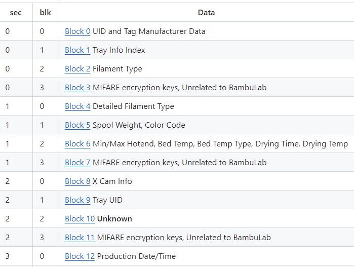

Pas vraiment d'information pour le moment.

Chez Anycubic, pour l'instant (2024-07-31) seuls les bobines 
* couleur pantone Anycubic
  * https://store.anycubic.com/products/pla-basic-pantone-color-filament?variant=44483185410210
   
semblent avoir un tag RFID.

## Les inconnues

* Compatibilité avec les puces RFID des bobines BambuLab ? 
  * Un ACE Pro arrive-t-il à lire les infos d'une bobine BambuLab ?
    * La Kobra 3 arrive telle à interpréter correctement les infos des puces RFID des bobines BambuLab ?
* Compatibilité des tags RFID des bobines Anycubic avec les AMS de BambuLab ?
  * Un AMS arrive-t-il à lire les infos d'une bobine Anycubic ?
* Description de la structure de données embarquée dans un tag RFID ( Si on lit la puce RFID, comment déchiffrer le code brut )

 Pour référence 
 * [[BREAKING NEWS] Les tags RFID des Bambu (pour usage AMS) ont été partiellement décodées](https://www.lesimprimantes3d.fr/forum/topic/51738-breaking-news-les-tags-rfid-des-bambu-pour-usage-ams-ont-%C3%A9t%C3%A9-partiellement-d%C3%A9cod%C3%A9es/?do=findComment&comment=534263)

---

https://discord.com/channels/966957505580236851/1230084715185442857/1268056514195886141

> It turns out Anycubic does sell PLA filament with RFID besides the 4 Pantone colors we know about. They only have the one bright white available that I could find. "【RFID Filament Enhanced Smart Printing】The Anycubic Color Engine Pro precisely detects RFID filaments, automatically optimizing printer settings for the best results. ***No more tedious and complicated setup adjustments***, ensures precise execution of every print job and minimizes filament wastage. Just load the filaments and start printing. This feature is only applicable to the Anycubic Kobra 3 Combo 3D Printer."
>
> 【RFID Filament Enhanced Smart Printing】The Anycubic Color Engine Pro precisely detects RFID filaments, automatically optimizing printer settings for the best results. No more tedious and complicated setup adjustments, ensures precise execution of every print job and minimizes filament wastage. Just load the filaments and start printing. This feature is only applicable to the Anycubic Kobra 3 Combo 3D Printer.
>
> https://www.amazon.com/dp/B0D66SN9MP?ref=cm_sw_r_cso_em_apin_dp_C5481MK4B2B425QE87WA&ref_=cm_sw_r_cso_em_apin_dp_C5481MK4B2B425QE87WA&social_share=cm_sw_r_cso_em_apin_dp_C5481MK4B2B425QE87WA&starsLeft=1&skipTwisterOG=2&th=1
>
> > ANYCUBIC PLA 3D Printer Filament, RFID 3D Printing PLA Filament 1.75mm Dimensional Accuracy +/- 0.02mm, 1KG Spool (2.2 lbs), Bright White

---

https://discord.com/channels/966957505580236851/1230084715185442857/1268252511878385694

> I don't see how the RFID would effect Z offset unless there is some weird bug in the firmware corrupting things. Looking at the content of the RFID, its color, PLA, manufacturer and checksums. See below.

Source image https://media.discordapp.net/attachments/1230084715185442857/1268252519369281536/image.png?ex=66abbfb3&is=66aa6e33&hm=92dfe7d433bce72c73ae7fd2e7a24bc703c02e602803c953515a27d5a3a638ee&=&format=webp&quality=lossless

---

